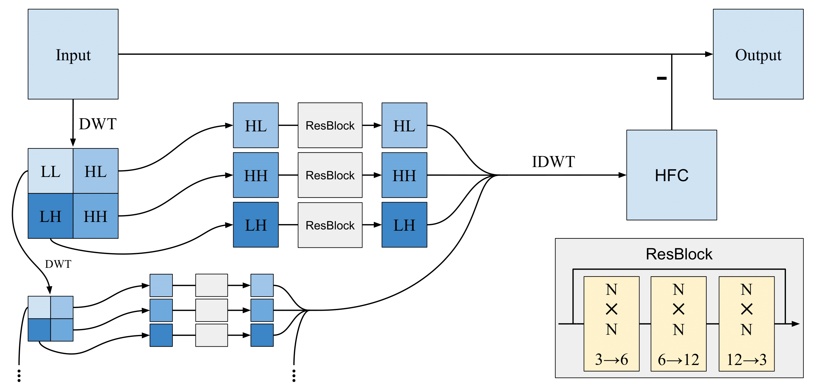

# WaveDamp: Enhancing Natural Robustness in Endoscopy Through Wavelet-Based Frequency Damping

<p align="center">
  
</p>

## Overview

WaveDamp introduces a frequency damper module designed to suppress high-frequency content in images, encouraging deep neural networks (DNNs) to distribute attention across all frequency bands. WaveDamp significantly enhances medical robustness on naturally distorted endoscopic images and can be integrated with any existing network architecture and used alongside standard augmentation methods.

## Frequency Damper Architecture

The figure below demonstrates the wavelet-based architecture used to supress frequencies in images during training.

<p align="center">
  
</p>

## Features
- Frequency-based image damping for improved robustness
- Easy integration with PyTorch models
- Compatible with standard and custom augmentations

## Installation

1. Clone this repository:
   ```bash
   git clone <repo_url>
   cd WaveDamp
   ```
2. Install dependencies:
   ```bash
   pip install -r requirements.txt
   ```

## Training

### 1. Train the Frequency Damper
Train the damper module on your dataset:
```bash
python model/train_damper.py <path/to/dataset>
```
This will save the trained damper weights in the `pretrained/` directory.

### 2. Train a Backbone Network Using WaveDamp
After training the damper, you can train a backbone network (e.g., ResNet) with WaveDamp augmentation:
```bash
python training/train_model.py <path/to/dataset> --name <experiment_name> --WaveDamp
```
- `--WaveDamp`: Enables WaveDamp augmentation during training
- `--name`: Sets the experiment name for checkpoints and logs

### 3. Evaluate the Trained Network
Evaluate the robustness and performance of your trained model:
```bash
python training/train_model.py <path/to/dataset> --evaluate --resume <path/to/checkpoint>
```

## Example Workflow
1. Train the damper:
   ```bash
   python model/train_damper.py /data/imagenet
   ```
2. Train a backbone network with WaveDamp:
   ```bash
   python training/train_model.py /data/imagenet --name resnet50_wavedamp --WaveDamp
   ```
3. Evaluate:
   ```bash
   python training/train_model.py /data/imagenet --evaluate --resume training/weights/best_resnet50_wavedamp_1.pth.tar
   ```

## Citation
If you use WaveDamp in your research, please cite:
```
Coming Soon
```